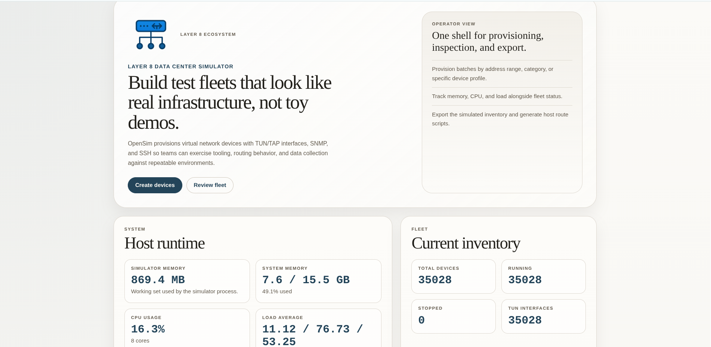

# OpenSim - Network Device Simulator



A powerful, scalable network and infrastructure simulator that provides realistic SNMP, SSH, and REST API interfaces for testing network management applications, monitoring systems, and automation tools. OpenSim can simulate thousands of network devices, storage systems, and Linux servers with dedicated IP addresses using TUN/TAP interfaces.

## 🌟 Features

- **Multi-Protocol Support**: SNMP v2c, SSH, and REST API simulation
- **Scalable Architecture**: Support for 10,000+ simulated devices
- **Realistic Device Behavior**: Configurable SNMP OIDs, SSH commands, and API responses
- **TUN/TAP Integration**: Each device gets its own IP address via TUN interfaces
- **Web Management UI**: Beautiful web interface for device management
- **RESTful API**: Complete REST API for programmatic control
- **High Performance**: Optimized for minimal resource usage
- **Device Export**: Export device configurations to CSV and routing scripts
- **Customizable Resources**: JSON-based configuration for SNMP, SSH, and API responses
- **Enhanced Polling System**: Comprehensive OID coverage for network monitoring applications
- **Robust SNMP Engine**: Improved stability with proper ASN.1 encoding and error handling
- **Storage System Simulation**: AWS S3, Pure Storage, NetApp ONTAP, Dell EMC Unity with REST APIs
- **Linux Server Simulation**: Comprehensive Ubuntu server with 36+ SSH commands
- **CDP & LLDP Support**: Cisco Discovery Protocol and LLDP for network topology discovery

## 🚀 Quick Start

### Prerequisites

- Linux system with root access (required for TUN interface creation)
- Go 1.23+ installed
- Basic networking tools (`ip`, `iptables`)

### Installation

1. **Clone the repository:**
   ```bash
   git clone https://github.com/saichler/opensim.git
   cd opensim
   ```

2. **Install dependencies:**
   ```bash
   cd go
   go mod tidy
   ```

3. **Build the simulator:**
   ```bash
   go build -o sim/sim ./sim
   ```

4. **Run with root privileges:**
   ```bash
   sudo ./sim/sim
   ```

### Auto-Setup for Ubuntu

For Ubuntu systems, use the automated setup script:

```bash
sudo ./ubuntu_setup.sh
```

This script installs all dependencies, configures system limits, and sets up TUN/TAP support.

## 📖 Usage

### Command Line Options

```bash
sudo ./sim/sim [options]

Options:
  -auto-start-ip string    Auto-create devices starting from this IP (e.g., 192.168.100.1)
  -auto-count int         Number of devices to auto-create (requires -auto-start-ip)
  -auto-netmask string    Netmask for auto-created devices (default: "24")
  -port string           Server port (default: "8080")
  -help                  Show help message
```

### Examples

```bash
# Start server only
sudo ./sim/sim

# Auto-create 5 devices starting from 192.168.100.1
sudo ./sim/sim -auto-start-ip 192.168.100.1 -auto-count 5

# Custom port and subnet
sudo ./sim/sim -auto-start-ip 10.10.10.1 -auto-count 100 -port 9090
```

## 🌐 Web Interface

Access the web UI at `http://localhost:8080/` for:

- Create and manage simulated devices
- View device status and configurations
- Export device lists to CSV
- Generate routing scripts
- Real-time device monitoring

## 📡 API Reference

### Create Devices
```bash
curl -X POST http://localhost:8080/api/v1/devices \
  -H "Content-Type: application/json" \
  -d '{
    "start_ip": "192.168.100.1",
    "device_count": 10,
    "netmask": "24"
  }'
```

### List Devices
```bash
curl http://localhost:8080/api/v1/devices
```

### Export Devices to CSV
```bash
curl http://localhost:8080/api/v1/devices/export -o devices.csv
```

### Download Route Script
```bash
curl http://localhost:8080/api/v1/devices/routes -o add_routes.sh
```

### Delete Device
```bash
curl -X DELETE http://localhost:8080/api/v1/devices/{device-id}
```

### Delete All Devices
```bash
curl -X DELETE http://localhost:8080/api/v1/devices
```

## 🔧 Device Interaction

### SSH Access
```bash
# Connect to any simulated device
ssh simadmin@192.168.100.1
# Password: simadmin

# Example commands:
show version
show interfaces
show ip route
ping 8.8.8.8
```

### SNMP Queries
```bash
# Query device system information
snmpget -v2c -c public 192.168.100.1 1.3.6.1.2.1.1.1.0

# Walk interface table
snmpwalk -v2c -c public 192.168.100.1 1.3.6.1.2.1.2.2.1
```

### Linux Server Commands
```bash
# Connect to a Linux server device
ssh simadmin@192.168.100.1

# Available commands include:
uname -a              # System information
cat /etc/os-release   # OS details
lscpu                 # CPU information
free -h               # Memory usage
df -h                 # Disk space
ip addr show          # Network interfaces
ps aux                # Running processes
docker ps             # Container status
systemctl list-units  # Running services
```

### CDP & LLDP Discovery
```bash
# On Cisco devices, view network neighbors
ssh simadmin@192.168.100.1

show cdp neighbors           # Brief neighbor list
show cdp neighbors detail    # Detailed neighbor info
show lldp neighbors          # LLDP neighbor discovery
```

## 💾 Storage System Simulation

OpenSim supports enterprise storage system simulation with REST API endpoints on port 8443.

### Supported Storage Systems

| System | Protocols | Key Features |
|--------|-----------|--------------|
| AWS S3 | SNMP, SSH, REST | Bucket operations, object management, versioning |
| Pure Storage FlashArray | SNMP, SSH, REST | Volumes, hosts, pods, data reduction metrics |
| NetApp ONTAP | SNMP, SSH, REST | Aggregates, volumes, NFS/CIFS/iSCSI protocols |
| Dell EMC Unity | SNMP, SSH, REST | Pools, LUNs, filesystems, health monitoring |

### Storage API Examples

**Pure Storage FlashArray:**
```bash
# List volumes
curl -k https://192.168.100.1:8443/api/2.14/volumes

# Get array information
curl -k https://192.168.100.1:8443/api/2.14/arrays

# Space analytics
curl -k https://192.168.100.1:8443/api/2.14/arrays/space
```

**NetApp ONTAP:**
```bash
# Cluster info
curl -k https://192.168.100.1:8443/api/cluster

# List volumes
curl -k https://192.168.100.1:8443/api/storage/volumes

# Aggregates
curl -k https://192.168.100.1:8443/api/storage/aggregates
```

**AWS S3:**
```bash
# List buckets
curl http://192.168.100.1:8443/

# Bucket contents
curl http://192.168.100.1:8443/my-bucket
```

### Creating Storage Devices
```bash
# Create a Pure Storage device
curl -X POST http://localhost:8080/api/v1/devices \
  -H "Content-Type: application/json" \
  -d '{
    "start_ip": "192.168.100.1",
    "device_count": 1,
    "netmask": "24",
    "resource_file": "pure_storage_flasharray.json"
  }'

# Create a NetApp device
curl -X POST http://localhost:8080/api/v1/devices \
  -H "Content-Type: application/json" \
  -d '{
    "start_ip": "192.168.100.2",
    "device_count": 1,
    "netmask": "24",
    "resource_file": "netapp_ontap.json"
  }'
```

## ⚙️ Configuration

### Device Resources

The simulator uses JSON files to define SNMP OIDs and SSH command responses with comprehensive coverage:

**Available Device Types:**

*Network Devices:*
- Cisco: ASR9K, Catalyst 9500, ISR 4331, Nexus 9000, CRS-X (with CDP & LLDP)
- Juniper: MX240, SRX300, EX4300
- Palo Alto: PA-3220
- F5: BIG-IP i4800
- Arista: 7050X switches
- Fortinet: FortiGate firewalls

*Storage Systems:*
- AWS S3 Storage
- Pure Storage FlashArray
- NetApp ONTAP
- Dell EMC Unity

*Servers:*
- Linux Server (Ubuntu 24.04 LTS)

**Enhanced Features:**
- Complete physical inventory monitoring (chassis, power supplies, fans, temperatures)
- Interface statistics and operational status
- System information and hardware details
- Vendor-specific OID implementations

### Example Resource Configuration
```json
{
  "snmp": [
    {
      "oid": "1.3.6.1.2.1.1.1.0",
      "response": "Cisco IOS Software, Router Version 15.1"
    }
  ],
  "ssh": [
    {
      "command": "show version",
      "response": "Cisco IOS Software, Router Version 15.1\\nDevice Simulator v1.0"
    }
  ],
  "api": [
    {
      "method": "GET",
      "path": "/api/v1/system",
      "status": 200,
      "response": "{\"name\": \"device-01\", \"status\": \"healthy\"}"
    }
  ]
}
```

*Note: The `api` section is optional and used primarily for storage device simulation.*

## 📁 Project Structure

```
opensim/
├── go/                          # Go source code
│   ├── sim/                     # Main simulator package
│   │   ├── simulator.go         # Core simulator logic
│   │   ├── types.go            # Data structures
│   │   ├── snmp.go             # SNMP server implementation
│   │   ├── ssh.go              # SSH server implementation
│   │   ├── web.go              # Web UI and REST API
│   │   └── *.json              # Device resource configurations
│   ├── go.mod                  # Go module definition
│   └── vendor/                 # Vendored dependencies
├── *.md                        # Documentation files
├── *.sh                        # Setup and test scripts
└── opensim.png                 # Project logo
```

## 🔍 Troubleshooting

### Common Issues

1. **Permission Denied**: Ensure running with `sudo` for TUN interface creation
2. **Port Conflicts**: Use `-port` flag to specify alternative port
3. **TUN Module Missing**: Run `sudo modprobe tun`
4. **High Resource Usage**: See [SCALING_GUIDE.md](SCALING_GUIDE.md) for optimization
5. **SNMP Integer Encoding**: Fixed panic issues with negative integer values in ASN.1 encoding

### Debug Commands

```bash
# Check TUN interfaces
ip addr show | grep sim

# Verify device processes
ss -tulpn | grep -E "(161|22)"

# Monitor system resources
htop
```

### Log Files

- Application logs: stdout/stderr
- System logs: `journalctl -u <service-name>`
- Web access logs: Built into the application

## 📊 Performance & Scaling

The simulator is optimized for high-scale deployments:

- **Tested**: Up to 10,000 concurrent devices
- **Memory**: ~50MB base + ~1KB per device
- **CPU**: Minimal usage during steady state
- **Network**: Shared TUN interfaces reduce overhead

See [SCALING_GUIDE.md](SCALING_GUIDE.md) for detailed performance tuning.

## 🛠️ Development

### Building from Source

```bash
cd go
go mod download
go build -o sim/sim ./sim
```

### Running Tests

```bash
go test ./sim
```

### Contributing

1. Fork the repository
2. Create a feature branch
3. Make your changes
4. Test thoroughly
5. Submit a pull request

## 📚 Documentation

- [Ubuntu Requirements](UBUNTU_REQUIREMENTS.md) - System setup for Ubuntu
- [Scaling Guide](SCALING_GUIDE.md) - High-scale deployment tips
- [Port Binding Solutions](PORT_BINDING_SOLUTIONS.md) - Network configuration
- [TUN Troubleshooting](TUN_TROUBLESHOOTING.md) - TUN/TAP interface issues
- [Individual Interfaces Guide](INDIVIDUAL_INTERFACES_GUIDE.md) - Advanced networking
- [Device Mock Data Requirements](go/sim/DEVICE_MOCK_DATA_REQUIREMENTS.md) - Device simulation coverage
- [Physical Inventory Coverage](go/sim/PHYSICAL_INVENTORY_COVERAGE.md) - Hardware monitoring OIDs

## 🤝 Use Cases

- **Network Monitoring Testing**: Test SNMP polling applications
- **Automation Development**: Develop SSH-based network automation
- **Load Testing**: Simulate large network topologies
- **Training**: Network management skill development
- **CI/CD Testing**: Automated testing of network applications
- **Storage Management Testing**: Validate storage monitoring and provisioning tools
- **Infrastructure Monitoring**: Test Linux server monitoring and metrics collection
- **Topology Discovery**: Validate CDP/LLDP-based network mapping tools

## 📄 License

Licensed under the Apache License, Version 2.0. See [LICENSE](LICENSE) for details.

## 🙋 Support

For issues, questions, or contributions:

- Create an issue on GitHub
- Check existing documentation
- Review troubleshooting guides

---

**OpenSim** - Simulate networks, test at scale, develop with confidence.