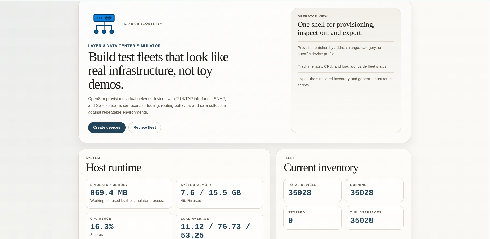

# OpenSim - Network Device Simulator



A powerful, scalable network and infrastructure simulator that provides realistic SNMP v2c/v3, SSH, and HTTPS REST API interfaces for testing network management applications, monitoring systems, and automation tools. OpenSim can simulate thousands of network devices, GPU servers, storage systems, and Linux servers with dedicated IP addresses using TUN interfaces and Linux network namespaces.

## Features

- **Multi-Protocol Support**: SNMP v2c/v3 (MD5/SHA1 auth, DES/AES128 privacy), SSH with VT100 terminal emulation, and HTTPS REST API simulation
- **Scalable Architecture**: Support for 25,000+ concurrent simulated devices
- **28 Device Types**: Routers, switches, firewalls, servers, GPU servers (NVIDIA DGX/HGX), storage systems, and Linux servers
- **GPU Server Simulation**: NVIDIA DGX-A100, DGX-H100, and HGX-H200 with per-GPU metrics (utilization, VRAM, temperature, power, fan speed, clock speeds)
- **Dynamic Metrics**: Realistic CPU, memory, temperature, and GPU metrics with sine-wave cycling patterns
- **Device Categories**: Organize devices by category (core routers, edge routers, DC switches, campus switches, firewalls, servers, GPU servers, storage)
- **Network Namespace Isolation**: Each device runs in its own Linux network namespace for realistic isolation
- **TUN/TAP Integration**: Each device gets its own IP address via TUN interfaces
- **HTTPS Storage APIs**: Secure REST API endpoints for storage device simulation with shared TLS certificates
- **Web Management UI**: Web interface for device management with real-time monitoring
- **RESTful API**: Complete REST API for programmatic control with round-robin and category-based device creation
- **High Performance**: Optimized with pre-generated metrics, lock-free atomic indexing, and shared SSH/TLS keys
- **Device Export**: Export device configurations to CSV and routing scripts
- **Routing Protocol Support**: OSPF, BGP, and VRF simulation via SSH commands
- **Storage System Simulation**: AWS S3, Pure Storage, NetApp ONTAP, Dell EMC Unity with HTTPS REST APIs
- **Linux Server Simulation**: Comprehensive Ubuntu server with 36+ SSH commands
- **CDP & LLDP Support**: Cisco Discovery Protocol and LLDP for network topology discovery

## Quick Start

### Prerequisites

- Linux system with root access (required for TUN interface and network namespace creation)
- Go 1.23+ installed
- Basic networking tools (`ip`, `iptables`)

### Installation

1. **Clone the repository:**
   ```bash
   git clone https://github.com/saichler/opensim.git
   cd opensim
   ```

2. **Install dependencies:**
   ```bash
   cd go
   go mod tidy
   ```

3. **Build the simulator:**
   ```bash
   cd simulator
   go build -o simulator .
   ```

4. **Run with root privileges:**
   ```bash
   sudo ./simulator
   ```

### Auto-Setup for Ubuntu

For Ubuntu systems, use the automated setup script:

```bash
sudo ./ubuntu_setup.sh
```

This script installs all dependencies, configures system limits, and sets up TUN/TAP support.

## Usage

### Command Line Options

```bash
sudo ./simulator [options]

Options:
  -auto-start-ip string       Auto-create devices starting from this IP (e.g., 192.168.100.1)
  -auto-count int             Number of devices to auto-create (requires -auto-start-ip)
  -auto-netmask string        Netmask for auto-created devices (default: "24")
  -port string                Server port (default: "8080")
  -snmpv3-engine-id string    Enable SNMPv3 with specified engine ID
  -snmpv3-auth string         SNMPv3 auth protocol: none, md5, sha1 (default: "md5")
  -snmpv3-priv string         SNMPv3 privacy protocol: none, des, aes128 (default: "none")
  -no-namespace               Disable network namespace isolation (use root namespace)
  -help                       Show help message
```

### Examples

```bash
# Start server only
sudo ./simulator

# Auto-create 5 devices starting from 192.168.100.1
sudo ./simulator -auto-start-ip 192.168.100.1 -auto-count 5

# Custom port and subnet
sudo ./simulator -auto-start-ip 10.10.10.1 -auto-count 100 -port 9090

# Enable SNMPv3 with MD5 authentication and AES128 privacy
sudo ./simulator -snmpv3-engine-id 0x80001234 -snmpv3-auth md5 -snmpv3-priv aes128

# Disable network namespace isolation
sudo ./simulator -no-namespace -auto-start-ip 192.168.100.1 -auto-count 10
```

## Web Interface

Access the web UI at `http://localhost:8080/` for:

- Create and manage simulated devices with category filtering
- Choose specific device types or round-robin across all 28 types
- View device status, system stats (memory, CPU, load average)
- Export device lists to CSV
- Generate routing scripts
- Filter devices by ID, IP, interface, type, ports, or status

## API Reference

### Create Devices
```bash
# Create 10 devices with default round-robin
curl -X POST http://localhost:8080/api/v1/devices \
  -H "Content-Type: application/json" \
  -d '{
    "start_ip": "192.168.100.1",
    "device_count": 10,
    "netmask": "24",
    "round_robin": true
  }'

# Create devices filtered by category
curl -X POST http://localhost:8080/api/v1/devices \
  -H "Content-Type: application/json" \
  -d '{
    "start_ip": "192.168.100.1",
    "device_count": 3,
    "netmask": "24",
    "round_robin": true,
    "category": "GPU Servers"
  }'

# Create devices with SNMPv3
curl -X POST http://localhost:8080/api/v1/devices \
  -H "Content-Type: application/json" \
  -d '{
    "start_ip": "192.168.100.1",
    "device_count": 5,
    "netmask": "24",
    "snmpv3": {
      "enabled": true,
      "engine_id": "0x80001234",
      "username": "admin",
      "password": "authpass123",
      "auth_protocol": "md5",
      "priv_protocol": "aes128"
    }
  }'
```

### List Devices
```bash
curl http://localhost:8080/api/v1/devices
```

### Export Devices to CSV
```bash
curl http://localhost:8080/api/v1/devices/export -o devices.csv
```

### Download Route Script
```bash
curl http://localhost:8080/api/v1/devices/routes -o add_routes.sh
```

### Delete Device
```bash
curl -X DELETE http://localhost:8080/api/v1/devices/{device-id}
```

### Delete All Devices
```bash
curl -X DELETE http://localhost:8080/api/v1/devices
```

## Device Interaction

### SSH Access
```bash
# Connect to any simulated device (VT100 terminal emulation)
ssh simadmin@192.168.100.1
# Password: simadmin

# Example commands:
show version
show interfaces
show ip route
ping 8.8.8.8
```

### SNMP Queries
```bash
# SNMPv2c query
snmpget -v2c -c public 192.168.100.1 1.3.6.1.2.1.1.1.0

# Walk interface table
snmpwalk -v2c -c public 192.168.100.1 1.3.6.1.2.1.2.2.1

# SNMPv3 query (when enabled)
snmpget -v3 -l authPriv -u admin -a MD5 -A authpass123 -x AES -X privpass123 \
  -e 0x80001234 192.168.100.1 1.3.6.1.2.1.1.1.0
```

### Routing Protocol Commands
```bash
# On supported router devices
ssh simadmin@192.168.100.1

show ip ospf neighbor         # OSPF neighbors
show ip bgp summary          # BGP peering summary
show ip vrf                  # VRF instances
```

### Linux Server Commands
```bash
# Connect to a Linux server device
ssh simadmin@192.168.100.1

# Available commands include:
uname -a              # System information
cat /etc/os-release   # OS details
lscpu                 # CPU information
free -h               # Memory usage
df -h                 # Disk space
ip addr show          # Network interfaces
ps aux                # Running processes
docker ps             # Container status
systemctl list-units  # Running services
```

### CDP & LLDP Discovery
```bash
# On Cisco devices, view network neighbors
ssh simadmin@192.168.100.1

show cdp neighbors           # Brief neighbor list
show cdp neighbors detail    # Detailed neighbor info
show lldp neighbors          # LLDP neighbor discovery
```

## Storage System Simulation

OpenSim supports enterprise storage system simulation with HTTPS REST API endpoints on port 8443 using shared TLS certificates.

### Supported Storage Systems

| System | Protocols | Key Features |
|--------|-----------|--------------|
| AWS S3 | SNMP, SSH, REST | Bucket operations, object management, versioning |
| Pure Storage FlashArray | SNMP, SSH, REST | Volumes, hosts, pods, data reduction metrics |
| NetApp ONTAP | SNMP, SSH, REST | Aggregates, volumes, NFS/CIFS/iSCSI protocols |
| Dell EMC Unity | SNMP, SSH, REST | Pools, LUNs, filesystems, health monitoring |

### Storage API Examples

**Pure Storage FlashArray:**
```bash
# List volumes
curl -k https://192.168.100.1:8443/api/2.14/volumes

# Get array information
curl -k https://192.168.100.1:8443/api/2.14/arrays

# Space analytics
curl -k https://192.168.100.1:8443/api/2.14/arrays/space
```

**NetApp ONTAP:**
```bash
# Cluster info
curl -k https://192.168.100.1:8443/api/cluster

# List volumes
curl -k https://192.168.100.1:8443/api/storage/volumes

# Aggregates
curl -k https://192.168.100.1:8443/api/storage/aggregates
```

**AWS S3:**
```bash
# List buckets
curl http://192.168.100.1:8443/

# Bucket contents
curl http://192.168.100.1:8443/my-bucket
```

### Creating Storage Devices
```bash
# Create a Pure Storage device
curl -X POST http://localhost:8080/api/v1/devices \
  -H "Content-Type: application/json" \
  -d '{
    "start_ip": "192.168.100.1",
    "device_count": 1,
    "netmask": "24",
    "resource_file": "pure_storage_flasharray.json"
  }'

# Create a NetApp device
curl -X POST http://localhost:8080/api/v1/devices \
  -H "Content-Type: application/json" \
  -d '{
    "start_ip": "192.168.100.2",
    "device_count": 1,
    "netmask": "24",
    "resource_file": "netapp_ontap.json"
  }'
```

## Configuration

### Device Resources

The simulator uses a directory-based JSON resource structure for device definitions. Each device type has its own directory under `go/simulator/resources/` with JSON files split for maintainability (max 500 lines per file).

**Available Device Types (28 devices across 9 categories):**

*Core Routers:*
| Device | Ports | Description |
|--------|-------|-------------|
| Cisco ASR9K | 48 | High-end service provider router |
| Cisco CRS-X | 144 | Carrier-class router |
| Huawei NE8000 | 96 | Carrier-class router |
| Nokia 7750 SR-12 | 72 | IP/MPLS service router |
| Juniper MX960 | 96 | Service provider edge router |

*Edge Routers:*
| Device | Ports | Description |
|--------|-------|-------------|
| Juniper MX240 | 24 | Compact modular router |
| NEC IX3315 | 48 | Enterprise router |
| Cisco IOS | 4 | Standard IOS router |

*Data Center Switches:*
| Device | Ports | Description |
|--------|-------|-------------|
| Cisco Nexus 9500 | 48 | Data center spine switch |
| Arista 7280R3 | 32 | High-performance switch |

*Campus Switches:*
| Device | Ports | Description |
|--------|-------|-------------|
| Cisco Catalyst 9500 | 48 | Enterprise core switch |
| Extreme VSP4450 | 48 | Campus switch |
| D-Link DGS-3630 | 52 | L3 managed switch |

*Firewalls:*
| Device | Ports | Description |
|--------|-------|-------------|
| Palo Alto PA-3220 | 12 | Next-gen firewall |
| Fortinet FortiGate-600E | 20 | Enterprise firewall |
| SonicWall NSa 6700 | 16 | Next-gen firewall |
| Check Point 15600 | 24 | Security gateway |

*Servers:*
| Device | Ports | Description |
|--------|-------|-------------|
| Dell PowerEdge R750 | 4 | Server BMC/iDRAC |
| HPE ProLiant DL380 | 4 | Server iLO interface |
| IBM Power S922 | 4 | Power Systems server |
| Linux Server | - | Ubuntu 24.04 LTS (SNMP, SSH) |

*GPU Servers:*
| Device | GPUs | VRAM/GPU | Description |
|--------|------|----------|-------------|
| NVIDIA DGX-A100 | 8 | 80 GB | A100 GPU training system |
| NVIDIA DGX-H100 | 8 | 80 GB | H100 GPU training system |
| NVIDIA HGX-H200 | 8 | 141 GB | H200 GPU inference system |

*Storage Systems:*
| Device | Type | Protocols |
|--------|------|-----------|
| AWS S3 Storage | Object storage | SNMP, SSH, HTTPS REST |
| Pure Storage FlashArray | All-flash array | SNMP, SSH, HTTPS REST |
| NetApp ONTAP | Unified storage | SNMP, SSH, HTTPS REST |
| Dell EMC Unity | Unified storage | SNMP, SSH, HTTPS REST |

**Enhanced Features:**
- **Entity MIB Alignment**: All network devices have properly aligned ifTable and Entity MIB data
- **Complete physical inventory**: Chassis, line cards, power supplies, fans, temperature sensors
- **entAliasMappingTable**: Proper mapping between physical ports and logical interfaces
- **Dynamic metrics**: Realistic CPU, memory, and temperature cycling with sine-wave patterns
- **GPU metrics via NVIDIA DCGM OIDs**: Per-GPU utilization, VRAM, temperature, power, fan speed, clock speeds
- **SNMPv3 support**: Engine ID, MD5/SHA1 authentication, DES/AES128 privacy
- Interface statistics and operational status
- System information and hardware details
- Vendor-specific OID implementations
- CDP & LLDP support for network topology discovery
- OSPF, BGP, and VRF routing protocol simulation via SSH

### Example Resource Configuration
```json
{
  "snmp": [
    {
      "oid": "1.3.6.1.2.1.1.1.0",
      "response": "Cisco IOS Software, Router Version 15.1"
    }
  ],
  "ssh": [
    {
      "command": "show version",
      "response": "Cisco IOS Software, Router Version 15.1\\nDevice Simulator v1.0"
    }
  ],
  "api": [
    {
      "method": "GET",
      "path": "/api/v1/system",
      "status": 200,
      "response": "{\"name\": \"device-01\", \"status\": \"healthy\"}"
    }
  ]
}
```

*Note: The `api` section is optional and used primarily for storage device simulation.*

## Project Structure

```
opensim/
├── go/                              # Go source code
│   ├── simulator/                   # Main simulator package (~28 Go files)
│   │   ├── simulator.go             # Entry point, CLI flags
│   │   ├── manager.go               # Device management, shared TLS/SSH keys
│   │   ├── device.go                # Device lifecycle
│   │   ├── snmp.go                  # SNMP v2c/v3 server
│   │   ├── snmpv3_crypto.go         # SNMPv3 auth/priv encryption
│   │   ├── snmp_handlers.go         # OID-specific response handlers
│   │   ├── ssh.go                   # SSH server with VT100
│   │   ├── api.go                   # REST API handlers
│   │   ├── device_profiles.go       # Device metric profiles by category
│   │   ├── gpu_metrics.go           # Per-GPU metric generation
│   │   ├── metrics_cycler.go        # CPU/memory/temp metric cycling
│   │   ├── metrics_oids.go          # SNMP handlers for dynamic metrics
│   │   ├── netns.go                 # Network namespace management
│   │   ├── resources.go             # Resource loading logic
│   │   ├── types.go                 # Data structures
│   │   ├── web/                     # Web UI static files
│   │   │   ├── index.html           # Main UI page
│   │   │   ├── app_ui.js            # UI JavaScript
│   │   │   └── app_api.js           # API JavaScript
│   │   └── resources/               # Device resource definitions
│   │       ├── asr9k/               # Cisco ASR9K (48 ports)
│   │       ├── nvidia_dgx_a100/     # NVIDIA DGX-A100 (8 GPUs)
│   │       ├── nvidia_dgx_h100/     # NVIDIA DGX-H100 (8 GPUs)
│   │       ├── nvidia_hgx_h200/     # NVIDIA HGX-H200 (8 GPUs)
│   │       ├── pure_storage_flasharray/
│   │       ├── linux_server/
│   │       └── ...                  # 28 device directories total
│   ├── l8/                          # Layer 8 service (vnet + HTTPS web proxy)
│   │   ├── main.go                  # vnet, vnic, web service
│   │   ├── web/                     # Landing page
│   │   ├── Dockerfile               # Multi-stage Docker build
│   │   └── opensim.yaml             # K8s StatefulSet manifest
│   ├── proxy/                       # HTTP proxy to simulator
│   ├── tests/                       # Device and polling tests
│   ├── go.mod                       # Go module definition
│   └── go.sum                       # Go module checksums
├── *.md                             # Documentation files
├── *.sh                             # Setup and test scripts
└── opensim.png                      # Project logo
```

### Resource Directory Structure

Each device type has its own directory with JSON files split into manageable chunks:

```
resources/
├── asr9k/
│   ├── asr9k_snmp_1.json      # System MIB, ifNumber
│   ├── asr9k_snmp_2.json      # ifTable entries
│   ├── asr9k_snmp_3_1.json    # ifXTable entries (part 1)
│   ├── asr9k_snmp_3_2.json    # ifXTable entries (part 2)
│   ├── asr9k_snmp_4.json      # Entity MIB
│   └── asr9k_snmp_5.json      # entAliasMappingTable
└── ...
```

The loader automatically merges all JSON files in a device directory, allowing large configurations to be split across multiple files for maintainability.

## Troubleshooting

### Common Issues

1. **Permission Denied**: Ensure running with `sudo` for TUN interface creation
2. **Port Conflicts**: Use `-port` flag to specify alternative port
3. **TUN Module Missing**: Run `sudo modprobe tun`
4. **High Resource Usage**: See [SCALING_GUIDE.md](SCALING_GUIDE.md) for optimization
5. **SNMP Integer Encoding**: Fixed panic issues with negative integer values in ASN.1 encoding

### Debug Commands

```bash
# Check TUN interfaces
ip addr show | grep sim

# Verify device processes
ss -tulpn | grep -E "(161|22)"

# Monitor system resources
htop
```

### Log Files

- Application logs: stdout/stderr
- System logs: `journalctl -u <service-name>`
- Web access logs: Built into the application

## Performance & Scaling

The simulator is optimized for high-scale deployments:

- **Tested**: Up to 25,000+ concurrent devices
- **Memory**: ~50MB base + ~1KB per device
- **CPU**: Minimal usage during steady state
- **Network**: Network namespace isolation prevents systemd-networkd overhead
- **Optimization**: Pre-generated metrics, lock-free atomic indexing, shared SSH/TLS keys

See [SCALING_GUIDE.md](SCALING_GUIDE.md) for detailed performance tuning.

## Development

### Building from Source

```bash
cd go/simulator
go mod download
go build -o simulator .
```

### Running Tests

```bash
go test ./...
```

### Contributing

1. Fork the repository
2. Create a feature branch
3. Make your changes
4. Test thoroughly
5. Submit a pull request

## Documentation

- [Ubuntu Requirements](UBUNTU_REQUIREMENTS.md) - System setup for Ubuntu
- [Scaling Guide](SCALING_GUIDE.md) - High-scale deployment tips
- [Port Binding Solutions](PORT_BINDING_SOLUTIONS.md) - Network configuration
- [TUN Troubleshooting](TUN_TROUBLESHOOTING.md) - TUN/TAP interface issues
- [Individual Interfaces Guide](INDIVIDUAL_INTERFACES_GUIDE.md) - Advanced networking
- [Device Mock Data Requirements](go/simulator/DEVICE_MOCK_DATA_REQUIREMENTS.md) - Device simulation coverage
- [Physical Inventory Coverage](go/simulator/PHYSICAL_INVENTORY_COVERAGE.md) - Hardware monitoring OIDs

## Use Cases

- **Network Monitoring Testing**: Test SNMP v2c/v3 polling applications with dynamic metrics
- **GPU Infrastructure Monitoring**: Validate GPU monitoring tools against NVIDIA DCGM OIDs
- **Automation Development**: Develop SSH-based network automation with VT100 terminal support
- **Load Testing**: Simulate large network topologies with 25,000+ devices
- **Training**: Network management skill development
- **CI/CD Testing**: Automated testing of network applications
- **Storage Management Testing**: Validate storage monitoring and provisioning tools via HTTPS APIs
- **Infrastructure Monitoring**: Test Linux server and GPU server monitoring and metrics collection
- **Topology Discovery**: Validate CDP/LLDP-based network mapping tools

## License

Licensed under the Apache License, Version 2.0. See [LICENSE](LICENSE) for details.

## Support

For issues, questions, or contributions:

- Create an issue on GitHub
- Check existing documentation
- Review troubleshooting guides

---

**OpenSim** - Simulate networks, test at scale, develop with confidence.