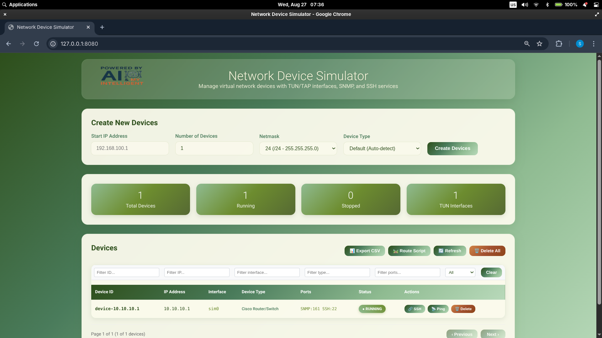

# OpenSim - Network Device Simulator



A powerful, scalable network device simulator that provides realistic SNMP and SSH interfaces for testing network management applications, monitoring systems, and automation tools. OpenSim can simulate thousands of network devices with dedicated IP addresses using TUN/TAP interfaces.

## 🌟 Features

- **Multi-Protocol Support**: SNMP v2c and SSH protocol simulation
- **Scalable Architecture**: Support for 10,000+ simulated devices
- **Realistic Device Behavior**: Configurable SNMP OIDs and SSH command responses
- **TUN/TAP Integration**: Each device gets its own IP address via TUN interfaces
- **Web Management UI**: Beautiful web interface for device management
- **RESTful API**: Complete REST API for programmatic control
- **High Performance**: Optimized for minimal resource usage
- **Device Export**: Export device configurations to CSV and routing scripts
- **Customizable Resources**: JSON-based configuration for SNMP and SSH responses

## 🚀 Quick Start

### Prerequisites

- Linux system with root access (required for TUN interface creation)
- Go 1.23+ installed
- Basic networking tools (`ip`, `iptables`)

### Installation

1. **Clone the repository:**
   ```bash
   git clone https://github.com/saichler/opensim.git
   cd opensim
   ```

2. **Install dependencies:**
   ```bash
   cd go
   go mod tidy
   ```

3. **Build the simulator:**
   ```bash
   go build -o sim/sim ./sim
   ```

4. **Run with root privileges:**
   ```bash
   sudo ./sim/sim
   ```

### Auto-Setup for Ubuntu

For Ubuntu systems, use the automated setup script:

```bash
sudo ./ubuntu_setup.sh
```

This script installs all dependencies, configures system limits, and sets up TUN/TAP support.

## 📖 Usage

### Command Line Options

```bash
sudo ./sim/sim [options]

Options:
  -auto-start-ip string    Auto-create devices starting from this IP (e.g., 192.168.100.1)
  -auto-count int         Number of devices to auto-create (requires -auto-start-ip)
  -auto-netmask string    Netmask for auto-created devices (default: "24")
  -port string           Server port (default: "8080")
  -help                  Show help message
```

### Examples

```bash
# Start server only
sudo ./sim/sim

# Auto-create 5 devices starting from 192.168.100.1
sudo ./sim/sim -auto-start-ip 192.168.100.1 -auto-count 5

# Custom port and subnet
sudo ./sim/sim -auto-start-ip 10.10.10.1 -auto-count 100 -port 9090
```

## 🌐 Web Interface

Access the web UI at `http://localhost:8080/` for:

- Create and manage simulated devices
- View device status and configurations
- Export device lists to CSV
- Generate routing scripts
- Real-time device monitoring

## 📡 API Reference

### Create Devices
```bash
curl -X POST http://localhost:8080/api/v1/devices \
  -H "Content-Type: application/json" \
  -d '{
    "start_ip": "192.168.100.1",
    "device_count": 10,
    "netmask": "24"
  }'
```

### List Devices
```bash
curl http://localhost:8080/api/v1/devices
```

### Export Devices to CSV
```bash
curl http://localhost:8080/api/v1/devices/export -o devices.csv
```

### Download Route Script
```bash
curl http://localhost:8080/api/v1/devices/routes -o add_routes.sh
```

### Delete Device
```bash
curl -X DELETE http://localhost:8080/api/v1/devices/{device-id}
```

### Delete All Devices
```bash
curl -X DELETE http://localhost:8080/api/v1/devices
```

## 🔧 Device Interaction

### SSH Access
```bash
# Connect to any simulated device
ssh simadmin@192.168.100.1
# Password: simadmin

# Example commands:
show version
show interfaces
show ip route
ping 8.8.8.8
```

### SNMP Queries
```bash
# Query device system information
snmpget -v2c -c public 192.168.100.1 1.3.6.1.2.1.1.1.0

# Walk interface table
snmpwalk -v2c -c public 192.168.100.1 1.3.6.1.2.1.2.2.1
```

## ⚙️ Configuration

### Device Resources

The simulator uses JSON files to define SNMP OIDs and SSH command responses:

- `resources_asr9k.json` - Default ASR9K router simulation
- `asr9k_resources.json` - Alternative ASR9K configuration
- `asr9k_ssh_commands.json` - SSH command definitions

### Example SNMP Resource
```json
{
  "snmp": [
    {
      "oid": "1.3.6.1.2.1.1.1.0",
      "response": "Cisco IOS Software, Router Version 15.1"
    }
  ],
  "ssh": [
    {
      "command": "show version",
      "response": "Cisco IOS Software, Router Version 15.1\\nDevice Simulator v1.0"
    }
  ]
}
```

## 📁 Project Structure

```
opensim/
├── go/                          # Go source code
│   ├── sim/                     # Main simulator package
│   │   ├── simulator.go         # Core simulator logic
│   │   ├── types.go            # Data structures
│   │   ├── snmp.go             # SNMP server implementation
│   │   ├── ssh.go              # SSH server implementation
│   │   ├── web.go              # Web UI and REST API
│   │   └── *.json              # Device resource configurations
│   ├── go.mod                  # Go module definition
│   └── vendor/                 # Vendored dependencies
├── *.md                        # Documentation files
├── *.sh                        # Setup and test scripts
└── opensim.png                 # Project logo
```

## 🔍 Troubleshooting

### Common Issues

1. **Permission Denied**: Ensure running with `sudo` for TUN interface creation
2. **Port Conflicts**: Use `-port` flag to specify alternative port
3. **TUN Module Missing**: Run `sudo modprobe tun`
4. **High Resource Usage**: See [SCALING_GUIDE.md](SCALING_GUIDE.md) for optimization

### Debug Commands

```bash
# Check TUN interfaces
ip addr show | grep sim

# Verify device processes
ss -tulpn | grep -E "(161|22)"

# Monitor system resources
htop
```

### Log Files

- Application logs: stdout/stderr
- System logs: `journalctl -u <service-name>`
- Web access logs: Built into the application

## 📊 Performance & Scaling

The simulator is optimized for high-scale deployments:

- **Tested**: Up to 10,000 concurrent devices
- **Memory**: ~50MB base + ~1KB per device
- **CPU**: Minimal usage during steady state
- **Network**: Shared TUN interfaces reduce overhead

See [SCALING_GUIDE.md](SCALING_GUIDE.md) for detailed performance tuning.

## 🛠️ Development

### Building from Source

```bash
cd go
go mod download
go build -o sim/sim ./sim
```

### Running Tests

```bash
go test ./sim
```

### Contributing

1. Fork the repository
2. Create a feature branch
3. Make your changes
4. Test thoroughly
5. Submit a pull request

## 📚 Documentation

- [Ubuntu Requirements](UBUNTU_REQUIREMENTS.md) - System setup for Ubuntu
- [Scaling Guide](SCALING_GUIDE.md) - High-scale deployment tips
- [Port Binding Solutions](PORT_BINDING_SOLUTIONS.md) - Network configuration
- [TUN Troubleshooting](TUN_TROUBLESHOOTING.md) - TUN/TAP interface issues
- [Individual Interfaces Guide](INDIVIDUAL_INTERFACES_GUIDE.md) - Advanced networking

## 🤝 Use Cases

- **Network Monitoring Testing**: Test SNMP polling applications
- **Automation Development**: Develop SSH-based network automation
- **Load Testing**: Simulate large network topologies
- **Training**: Network management skill development
- **CI/CD Testing**: Automated testing of network applications

## 📄 License

Licensed under the Apache License, Version 2.0. See [LICENSE](LICENSE) for details.

## 🙋 Support

For issues, questions, or contributions:

- Create an issue on GitHub
- Check existing documentation
- Review troubleshooting guides

---

**OpenSim** - Simulate networks, test at scale, develop with confidence.